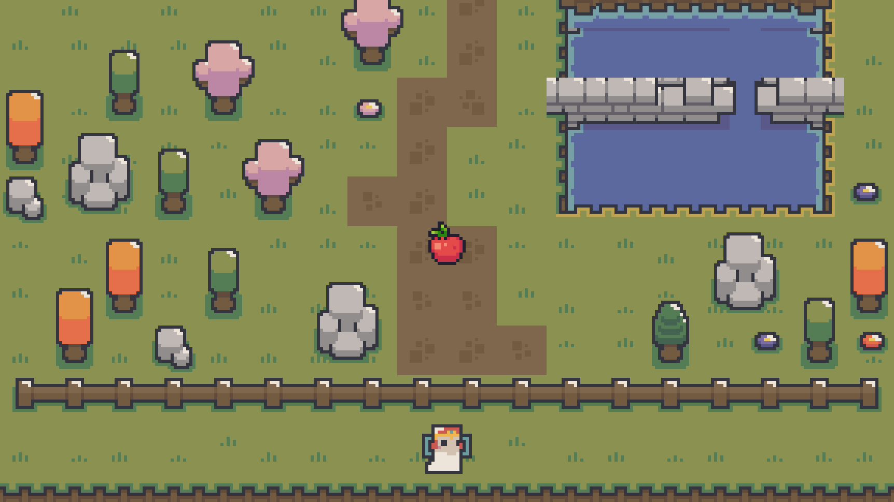

# Fairy Catch

An arcade game where you catch falling apples. Built with Godot 4.

## Play

Grab the latest build from [itch.io](https://terra2o.itch.io/fairy-catch).

## Build from source

1. Clone the repo
2. Open `project.godot` in Godot 4
3. Hit run or export

## License

Code is licensed under the [GNU GPL v3](LICENSE).

Assets are under mixed licenses. see [CREDITS.md](CREDITS.md) for details.  
Original music and art © terra2o, all rights reserved.

## Credits

See [CREDITS.md](CREDITS.md).
